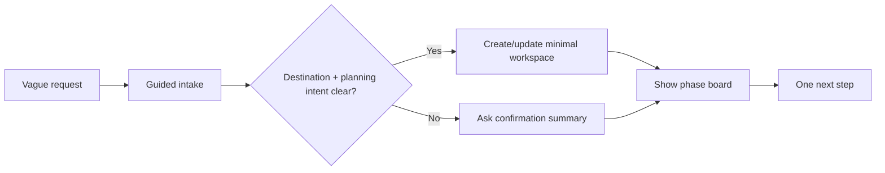

# feat: First Five Minutes Trip Workspace

## Overview

Upgrade the first trip-planning moment from "ask a few questions, then leave ChatGPT to stitch the rest together" into a compact guided workspace flow.

The target path is:



The plan carries forward the brainstorm decisions: optimize the first five minutes, use hybrid workspace creation, show readiness checks before feasibility scoring, and present planning phases instead of implementation lanes (see origin: `docs/brainstorms/2026-05-11-first-five-minutes-trip-workspace-requirements.md`).

## Problem Statement

The current codebase has most building blocks:

- `ask_trip_clarification` can open a transient clarification widget.
- `submit_trip_clarification` summarizes answers and closes the widget.
- `create_trip`, `add_trip_item`, `get_trip_board`, and `render_trip_board` persist and render trip state.
- Current widget changes already experiment with an intent picker, context bar, and phase-board CSS.

The gap is that these pieces do not yet produce one coherent first-five-minutes experience. The intent picker is mostly local UI state, the submit result does not yet encode a hybrid save decision, and the board still presents internal lanes instead of the user-facing phases selected in the origin requirements.

## Proposed Solution

Implement a first-run flow with three product layers:

1. **Guided intake:** capture planning priority and ask a short, priority-aware set of missing questions.
2. **Hybrid workspace creation:** after intake, return enough structured output for ChatGPT to either create/update a workspace automatically or ask for confirmation when destination/intent is ambiguous.
3. **Phase workspace summary:** render a board variant organized around `Researching`, `Chosen`, and `Confirmed`, with a compact readiness checklist and one next step.

This should extend the existing TypeScript domain builders and React widgets rather than introducing a standalone dashboard or external validation service.

## Technical Approach

### Phase 1: Domain Contract For First-Run Intake

- Extend the clarification domain so planning priority is part of the session/answer contract, not only widget-local state.
- Define priority-aware question ordering for:
  - `experience_first`
  - `budget_first`
  - `date_constrained`
  - `loyalty_driven`
- Keep the default question count short. The origin requires "enough to create a useful workspace, not a complete travel profile" (see origin).
- Preserve existing known-field omission behavior from `src/domain/clarification.ts`; do not ask for destination, dates, duration, hotel, or transport signals already present in known fields or trip state.
- Add deterministic readiness computation from known fields, trip fields, and saved items:
  - `known`
  - `missing`
  - `estimated`
  - `needs_check`

Recommended shape at planning level:

```ts
// src/domain/clarification.ts
type PlanningPriority =
  | "experience_first"
  | "budget_first"
  | "date_constrained"
  | "loyalty_driven";

type ReadinessCheck = {
  id: string;
  label: string;
  state: "known" | "missing" | "estimated" | "needs_check";
  value?: string;
};
```

The exact shape can change during implementation, but the public widget/tool props must remain typed in `src/domain/widgetTypes.ts`.

### Phase 2: Hybrid Save Decision

Update clarification submission output so ChatGPT receives a clear save decision:

- `auto_create_workspace` when destination and planning intent are clear.
- `confirm_workspace` when destination, intent, or user commitment is ambiguous.
- `save_constraints` or equivalent when enriching an existing trip.
- `ask_followup_text` when critical required fields remain missing.

This is not a new persistence tool by default. Existing learning says data/mutation tools and render tools should stay distinct, and `create_trip` should remain the mutation that creates durable workspace state (see `docs/solutions/integration-issues/apps-sdk-trip-workspace-mvp-tool-render-alignment-20260505.md`). The submit tool should produce model-visible structured output that makes the next tool choice unambiguous.

If implementation finds the ChatGPT tool chain unreliable, add a small helper tool only after preserving the separation between decision output and rendering.

### Phase 3: Phase Board View Model

Extend board building with a user-facing phase summary while preserving the current lane contract for backward compatibility.

Recommended mapping:

- `Researching`: inbox, needs_review, question, constraint, and unscheduled idea-like items.
- `Chosen`: shortlisted items and planned but unconfirmed itinerary items.
- `Confirmed`: booked items.

Missing pieces should move into a compact readiness/checklist area instead of appearing as a full lane in the first-run presentation (see origin). Existing `lanes.missing_pieces` can remain for older board consumers.

Add one derived next action, selected from the strongest blocker:

- Missing destination or ambiguous intent: confirm workspace.
- Missing dates/duration: answer dates.
- Missing transport: add transport.
- Missing stay: choose stay area or add hotel.
- No saved activities: add activities.
- Otherwise: continue planning.

### Phase 4: Widget Updates

Update `resources/trip-clarification/widget.tsx` so the intent picker:

- Writes planning priority into the answer/session payload.
- Communicates why the question order changed.
- Does not add a dead-end screen before useful questions.
- Keeps existing submit, retry, and close lifecycle behavior.

Update `resources/trip-board/widget.tsx` so it can render the first-run phase board:

- Phase cards: `Researching`, `Chosen`, `Confirmed`.
- Readiness checklist: known/missing/estimated/needs-check.
- One next step.
- Compact ChatGPT-native layout using existing design tokens.

Avoid using "live", "verified", global feasibility scores, or itinerary diagnostics in this first version unless the backing data is real (see origin).

### Phase 5: Tool Metadata And Tests

Update tool descriptions so ChatGPT understands the first-run chain:

- `ask_trip_clarification`: first action for vague trip requests.
- `submit_trip_clarification`: returns a save decision and readiness state.
- `create_trip`: still only after clear intent/confirmation or after clarification answers.
- `render_trip_board`: can show the phase board after workspace creation.

Keep schemas OpenAI-compatible. Prior learning requires rich fields to stay advertised through `tools/list`, with empty-string compatibility at tool boundaries where needed (see `docs/solutions/integration-issues/schema-compatible-mcp-chatgpt-apps-inspector-20260506.md`).

## Implementation Phases

### Phase 1: First-Run Domain Model

- [ ] Add planning priority to clarification session and widget props.
- [ ] Add priority-aware question ordering in `src/domain/clarification.ts`.
- [ ] Add readiness-check builder using known fields, trip, and items.
- [ ] Add unit tests for priority routing, known-field omission, and readiness states.

### Phase 2: Submission Decision Output

- [ ] Extend `summarizeClarification` output with hybrid save decision.
- [ ] Preserve close-widget metadata and widget `requestClose` behavior.
- [ ] Add tests for auto-create, confirmation-required, existing-trip enrichment, skipped answers, and partial completion.
- [ ] Update tool descriptions and MCP integration assertions for the expanded structured output.

### Phase 3: Phase Board Data

- [ ] Extend `buildBoard` or add a companion builder that returns user-facing phases.
- [ ] Keep existing `lanes` output stable unless a deliberate version change is made.
- [ ] Add readiness checklist and next-action fields to the board props or companion view model.
- [ ] Add domain tests for status-to-phase mapping and next-action priority.

### Phase 4: React Widgets

- [ ] Wire the clarification intent picker to real answer/session state.
- [ ] Render phase board, readiness checklist, and next action in the board widget.
- [ ] Keep the original lane board available when props do not include phase data, or intentionally update all stories/tools together.
- [ ] Fix current whitespace issues reported by `git diff --check` while touching these files.

### Phase 5: End-To-End Validation

- [ ] Add/update Storybook stories for vague first request, destination known, destination ambiguous, budget-first, date-constrained, existing trip enrichment, and partial close.
- [ ] Update `resources/stories/TripWorkflow.stories.tsx` with the full first-five-minutes flow.
- [ ] Add MCP integration coverage for clarification -> create trip -> render phase board.
- [ ] Run `npm run check`.
- [ ] Before submission-ready claims, validate in hosted ChatGPT Developer Mode as required by `docs/chatgpt_apps_readiness_review.md`.

## Alternative Approaches Considered

### Build A New `create_trip_from_clarification` Tool

Rejected for the first implementation. It could simplify one model step, but it risks coupling the transient clarification widget to durable mutation behavior. Existing architecture intentionally separates data/mutation and render responsibilities.

### Show Full Itinerary Diagnostics Immediately

Rejected by the origin requirements. The first version should use readiness checks only; feasibility scores and live diagnostics are out of scope until backed by real data.

### Replace Board Storage Statuses With New Phases

Rejected for now. The user-facing board can show phases while the store keeps granular item statuses. This lowers migration risk and preserves existing tests and tool behavior.

## System-Wide Impact

### Interaction Graph

1. User gives a vague trip request.
2. ChatGPT calls `ask_trip_clarification`.
3. Widget collects priority and a few missing answers.
4. Widget calls `submit_trip_clarification`.
5. Submit result closes the widget and returns resolved fields, readiness checks, and a save decision.
6. If auto-create is allowed, ChatGPT calls `create_trip` and optionally `add_trip_item` for constraints/preferences.
7. ChatGPT calls `render_trip_board` to show phase workspace.
8. User continues from one next action.

### Error & Failure Propagation

- Invalid `known_fields_json`, `session_json`, or `answers_json` should return existing `TripValidationError`-style tool errors.
- Widget bridge failures should preserve selected answers and show retry, following the existing clarification lifecycle learning.
- Store failures from `create_trip`, item saves, or board render should return `isError` tool results through `runTripTool`.
- Ambiguous destination/intent should not be treated as an error; it should produce `confirm_workspace`.

### State Lifecycle Risks

- Partial intake must not create false bookings or overconfident trip state.
- Auto-create should only happen after clear destination and planning intent, carrying forward the origin hybrid rule.
- Repeated submits can produce duplicate create attempts if ChatGPT retries. Mitigate with clear result text, tests, and potentially idempotent title/destination handling if implementation exposes that risk.
- Existing `add_trip_item` duplicate handling should be used for saved constraints/preferences.

### API Surface Parity

Likely files to update:

- `src/domain/clarification.ts`
- `src/domain/trips.ts`
- `src/domain/widgetTypes.ts`
- `src/tools/travelAgent.ts`
- `resources/trip-clarification/widget.tsx`
- `resources/trip-clarification/widget.stories.tsx`
- `resources/trip-board/widget.tsx`
- `resources/trip-board/widget.stories.tsx`
- `resources/stories/TripWorkflow.stories.tsx`
- `resources/styles.css`
- `tests/tripDomain.test.ts`
- `tests/travelAgentTools.test.ts`
- `tests/mcpIntegration.test.ts`
- `README.md` and `docs/testing_chatgpt_apps.md` if tool behavior or recommended smoke flow changes.

### Integration Test Scenarios

1. Vague known destination: "I want to plan a trip to Venice" -> clarify -> submit -> auto-create decision -> create trip -> phase board includes missing stay/transport/readiness.
2. Ambiguous destination: "I want a mountain weekend" -> clarify -> submit -> confirmation decision, no automatic create.
3. Existing trip enrichment: known trip has dates and hotel -> clarification omits duplicate questions and phase board preserves confirmed stay.
4. Partial submit/skip: user skips dates -> readiness marks dates missing or estimated, no feasibility score appears.
5. Protocol path: MCP `tools/list` schemas remain rich and OpenAI-compatible; render tools still advertise widget output templates.

## SpecFlow Analysis

### User Flow Overview

- **Happy path:** vague destination request -> priority intake -> 2-3 answers -> auto-create -> phase board -> next step.
- **Ambiguous path:** vague request without destination -> priority intake -> confirmation summary -> user confirms or refines.
- **Known-memory path:** user or trip state already contains dates/style/stay -> intake asks only missing high-value questions.
- **Partial path:** user skips/closes -> answer summary and readiness states preserve what is known without creating false commitments.
- **Retry path:** widget submit fails -> selections remain visible -> user retries.

### Missing Elements Resolved By This Plan

- Planning priority is persisted in the session/answers, not only displayed.
- Hybrid save behavior is explicit instead of implied by `recommended_next_action`.
- Board phases are added as a user-facing view over existing statuses.
- Readiness states replace unsupported feasibility/live claims.

### Remaining Planning-Time Questions

- Exact branching rules per priority should be finalized during implementation against the current question list.
- Phase view can be added either as an extension of `TripBoardProps` or as a companion view model; the lower-risk choice is to extend while preserving current lanes.
- Readiness vocabulary should stay minimal and deterministic for this version.

## Acceptance Criteria

### Functional Requirements

- [ ] `ask_trip_clarification` can capture a planning priority for underspecified trip-planning requests.
- [ ] Planning priority changes question ordering or selection.
- [ ] Known facts from utterance, known fields, or existing trip state suppress duplicate questions.
- [ ] `submit_trip_clarification` returns a hybrid save decision: auto-create, confirm, enrich existing trip, or ask follow-up.
- [ ] Ambiguous destination/intent does not auto-create a trip.
- [ ] Clear destination and planning intent can lead to a minimal workspace in one guided interaction.
- [ ] Board output can present `Researching`, `Chosen`, and `Confirmed` phases.
- [ ] Missing pieces render as a compact readiness/checklist area, not only as a full lane.
- [ ] Readiness checks label facts as known, missing, estimated, or needs check.
- [ ] No global feasibility score or "live" claim appears unless backed by real verification data.
- [ ] The board provides one next step after intake.

### Non-Functional Requirements

- [ ] Widgets remain compact and ChatGPT-native.
- [ ] Tool schemas remain OpenAI-compatible through MCP integration tests.
- [ ] Existing trip tools remain backward-compatible unless a deliberate plan update documents a contract change.
- [ ] Widget close and retry behavior remains intact.
- [ ] Mobile/narrow iframe layout does not overflow.

### Quality Gates

- [ ] `npm run typecheck`
- [ ] `npm test`
- [ ] `npm run build`
- [ ] `npm run check`
- [ ] `git diff --check`
- [ ] Storybook visual review for changed widget states.
- [ ] Hosted ChatGPT Developer Mode validation before submission-ready claims.

## Success Metrics

- For "I want to plan a trip to Venice", the app reaches a visible workspace with no more than one guided widget interaction.
- The resulting board makes at least one next step obvious without explanatory text.
- The app asks no duplicate question when matching state is already known.
- The first-run flow avoids unsupported "live" or feasibility claims.
- MCP integration tests prove the protocol path, not only direct handler calls.

## Dependencies & Risks

- **Model routing risk:** ChatGPT may still choose `create_trip` too early. Mitigate with tool description updates and MCP integration/Developer Mode checks.
- **Schema drift risk:** Extending props can break widget builds or OpenAI schema compatibility. Mitigate with `widgetTypes.ts`, MCP tests, and generated widget build checks.
- **UX clutter risk:** Readiness labels can become badge noise. Keep them sparse and decision-critical.
- **State duplication risk:** Auto-create may duplicate trips on retries. Keep auto-create decision model-visible, avoid hidden mutation inside submit, and evaluate idempotency during implementation.
- **Current dirty diff risk:** Existing uncommitted changes already modify clarification, itinerary, board-adjacent CSS, and include whitespace issues. Implementation should work with those changes rather than reverting them.

## Documentation Plan

- Update `README.md` tool descriptions if recommended first-run flow changes.
- Update `docs/testing_chatgpt_apps.md` with a first-five-minutes smoke flow.
- Update `docs/chatgpt_apps_readiness_review.md` only if this changes readiness status or hosted validation expectations.
- Consider adding a solution note after implementation if a new Apps SDK lifecycle or schema lesson is discovered.

## Sources & References

### Origin

- **Origin document:** [docs/brainstorms/2026-05-11-first-five-minutes-trip-workspace-requirements.md](../brainstorms/2026-05-11-first-five-minutes-trip-workspace-requirements.md)
  - Optimize the first five minutes first.
  - Use hybrid workspace creation.
  - Use readiness checks before feasibility scoring.
  - Present `Researching`, `Chosen`, and `Confirmed` phases.

### Internal References

- [src/domain/clarification.ts](../../src/domain/clarification.ts) - current clarification session, question selection, and answer summary.
- [src/domain/trips.ts](../../src/domain/trips.ts) - current item statuses, board grouping, itinerary, budget, and missing pieces.
- [src/tools/travelAgent.ts](../../src/tools/travelAgent.ts) - tool descriptors, `ask_trip_clarification`, `submit_trip_clarification`, and board render tools.
- [resources/trip-clarification/widget.tsx](../../resources/trip-clarification/widget.tsx) - current intent picker and widget submit lifecycle.
- [resources/trip-board/widget.tsx](../../resources/trip-board/widget.tsx) - current lane board and optimistic status updates.
- [resources/styles.css](../../resources/styles.css) - current phase-board and missing-zone CSS sketches.
- [docs/plans/2026-05-08-001-feat-trip-clarification-widget-plan.md](2026-05-08-001-feat-trip-clarification-widget-plan.md) - prior clarification widget implementation plan.

### Institutional Learnings

- [docs/solutions/integration-issues/apps-sdk-trip-workspace-mvp-tool-render-alignment-20260505.md](../solutions/integration-issues/apps-sdk-trip-workspace-mvp-tool-render-alignment-20260505.md) - keep data/mutation tools distinct from render tools.
- [docs/solutions/integration-issues/chatgpt-apps-trip-clarification-widget-lifecycle-20260508.md](../solutions/integration-issues/chatgpt-apps-trip-clarification-widget-lifecycle-20260508.md) - transient widgets need explicit close behavior and retry handling.
- [docs/solutions/integration-issues/schema-compatible-mcp-chatgpt-apps-inspector-20260506.md](../solutions/integration-issues/schema-compatible-mcp-chatgpt-apps-inspector-20260506.md) - public MCP schemas are the product contract.
- [docs/solutions/ui-bugs/chatgpt-native-widget-overflow-travel-mcp-widgets-20260504.md](../solutions/ui-bugs/chatgpt-native-widget-overflow-travel-mcp-widgets-20260504.md) - keep widgets compact, restrained, and mobile-safe.
- [docs/solutions/ui-bugs/storybook-widget-preview-v3-ui-drift-20260505.md](../solutions/ui-bugs/storybook-widget-preview-v3-ui-drift-20260505.md) - verify Storybook widget frames and keep resource/UI contracts aligned.
