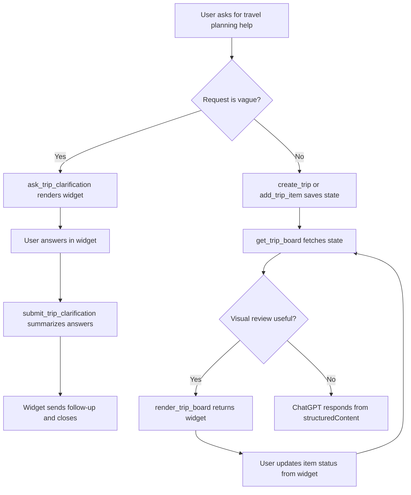

# refactor: Align MCP Apps metadata and validation

## Overview

Bring the current TypeScript `mcp-use` Travel MCP app into tighter alignment with the current Manufact MCP Apps guidance without deleting the working app or starting from the Quick Start template.

The current project is already close to the documented architecture: `MCPServer` from `mcp-use/server`, React widgets using `mcp-use/react`, widget props returned through `widget({ props, output })`, and a local Inspector workflow. The alignment pass should make MCP Apps metadata the primary contract, keep ChatGPT compatibility generated or explicitly tested, update validation coverage for both protocols, and remove or quarantine non-MVP widget surfaces that do not pass the trip-workspace product gate.

This carries forward the origin decision that the goal is not to restart the app, but to keep the trip-planning direction while correcting the implementation path before more UI complexity accumulates (see origin: `docs/brainstorms/2026-05-05-apps-sdk-revalidation-requirements.md`).

## Execution Result

Completed on 2026-05-13 on branch `codex/mcp-apps-metadata-alignment`.

- Added MCP Apps `_meta.ui.resourceUri` assertions alongside ChatGPT `openai/outputTemplate` compatibility assertions.
- Added unified widget invocation status metadata to retained trip-workspace widgets.
- Confirmed data-only tools such as `get_trip_board` and `add_trip_item` do not advertise widget templates.
- Updated README and validation docs with protocol-mode expectations and MVP widget scope.
- `npm run check` passes.
- `git diff --check` passes.

Hosted ChatGPT Developer Mode validation and a manual Inspector browser smoke remain the final deployment-readiness checks.

## Problem Statement

The app currently passes local checks, but the contract being tested is still partly ChatGPT/OpenAI-specific:

- `tests/mcpIntegration.test.ts` asserts `openai/outputTemplate` for widget tools, but does not assert the MCP Apps `_meta.ui.resourceUri` surface.
- `src/tools/travelAgent.ts` still manually emits `"openai/toolInvocation/invoking"` and `"openai/toolInvocation/invoked"` status metadata for non-widget tools.
- Widget metadata in `resources/*/widget.tsx` uses the unified `WidgetMetadata.metadata` shape, but the plan should verify what `mcp-use` generates in both MCP Apps and ChatGPT protocol modes.
- `docs/testing_chatgpt_apps.md` documents local and hosted validation, but not the current Manufact protocol-toggle checklist.
- Generic widgets such as destination guide, activity cards, packing checklist, and explore places still build as resources even though the MVP source document says generic support widgets are out of scope unless redesigned around saved trip state (see origin R5 and R7).

This matters because `tools/list`, resource metadata, and widget bridge behavior are the real runtime contract. Direct handler tests and a successful widget build do not prove ChatGPT or MCP Apps clients will render and interact correctly.

## Proposed Solution

Keep the TypeScript app and run a focused alignment pass:

1. Audit generated MCP descriptors and widget resources in both MCP Apps and ChatGPT protocol modes.
2. Make unified MCP Apps metadata the primary expected surface in code and tests.
3. Preserve ChatGPT compatibility aliases where needed, but avoid manually duplicating OpenAI-only fields if `mcp-use` can derive them from unified metadata.
4. Keep the data/render split for richer workspace flows, especially `get_trip_board` and `render_trip_board`.
5. Gate every built widget through the MVP trip-workspace product filter.
6. Update docs and automated tests so future work validates both protocols before hosted Developer Mode claims.

## Current Local Findings

### Working Foundation

- `src/server.ts:1` imports `MCPServer` from `mcp-use/server`.
- `src/server.ts:5` exposes `createTravelServer(settings)` for testable server construction.
- `src/tools/travelAgent.ts:136` registers 13 travel tools through `server.tool`.
- `src/tools/travelAgent.ts:335` and later return widgets through `widget({ props, output })`.
- `resources/trip-board/widget.tsx:1` uses `McpUseProvider`, `useWidget`, and `useCallTool`.
- `package.json:12` uses `mcp-use dev`, `mcp-use build`, and `mcp-use start`.
- `tests/mcpIntegration.test.ts:23` starts a real MCP server and calls tools through `MCPClient`.

### Current Validation Result

`npm run check` passed on 2026-05-12:

```text
TypeScript typecheck passed.
Vitest: 4 files passed, 28 tests passed, 1 skipped.
mcp-use build passed.
9 widgets built.
```

`git diff --check` currently reports one pre-existing whitespace issue in `resources/trip-itinerary/widget.tsx:113`. This plan should not ignore it if the implementation touches that file.

### Contract Gaps

- MCP integration tests assert only `openai/outputTemplate`, not MCP Apps `_meta.ui.resourceUri`.
- Status metadata for non-widget tools is still OpenAI-prefixed in `statusMeta`.
- The generated resource contract needs to be inspected under the Inspector protocol toggle, not inferred from source.
- Hosted ChatGPT Developer Mode remains a submission-readiness blocker.
- Non-MVP widgets continue to build and may broaden the app surface beyond the saved trip workspace.

## Technical Approach

### Phase 1: Descriptor and Resource Audit

Run an inspection script or test helper that starts `createTravelServer` on an ephemeral port and captures:

- `tools/list` for all 13 tools.
- Tool `_meta` for widget tools and data-only tools.
- Registered resources from the MCP server.
- Widget resource metadata for both MCP Apps and ChatGPT protocol modes when available through `mcp-use` Inspector or adapters.

Expected audit questions:

- Do widget tools expose `_meta.ui.resourceUri` for MCP Apps clients?
- Do the same widget tools expose `openai/outputTemplate` for ChatGPT?
- Are invocation status strings generated from unified `metadata.invoking` / `metadata.invoked`, or does current code need explicit compatibility metadata?
- Do `metadata.csp.connectDomains` and `metadata.csp.resourceDomains` transform correctly into ChatGPT `openai/widgetCSP` snake_case fields?
- Are resource URIs stable and intentionally versioned?

### Phase 2: Metadata Contract Alignment

Update the code to prefer the unified metadata model documented by Manufact:

```ts
metadata: {
  csp: {
    connectDomains: [],
    resourceDomains: [],
  },
  prefersBorder: true,
  invoking: "Rendering trip board",
  invoked: "Rendered trip board",
  widgetDescription: "Trip planning board grouped by decisions, shortlist, booked items, itinerary, and gaps.",
}
```

Implementation should verify whether `mcp-use` supports these fields through `widgetMetadata` and `server.tool({ widget })` for generated resources. If it does, replace manual OpenAI status metadata in `statusMeta` with unified metadata for renderable resources and keep OpenAI-only fields only where no unified equivalent exists.

Do not remove `openai/closeWidget` from `submit_trip_clarification` unless current docs or runtime tests show a unified close equivalent that works in ChatGPT. The prior lifecycle fix deliberately uses both widget-originated `requestClose()` and tool-result metadata.

### Phase 3: Tool/Render Surface Review

Keep the current role split:

- Data and mutation tools return reusable `structuredContent`.
- Render tools own widget display.
- Simple one-shot tools may remain data-plus-render only when the UI directly answers the user request.

Specific checks:

- `add_trip_item` must stay mutation-first and should not advertise a widget.
- `get_trip_board` must stay data-only.
- `render_trip_board` must own the board widget.
- `prepare_trip_clarification` must stay data-only.
- `ask_trip_clarification` and `render_trip_clarification` should own the clarification widget.
- `list_trip_inbox`, `get_trip_itinerary`, and `get_trip_budget` may remain simple renderable tools if the implementation documents why they pass the helpful-UI test.

This carries forward origin R4 and the prior solution guidance that richer trip workspace flows need chainable `structuredContent` before rendering.

### Phase 4: MVP Widget Gate

Audit every widget built by `mcp-use build`:

- `trip-inbox`
- `trip-board`
- `trip-itinerary`
- `trip-budget`
- `trip-clarification`
- `explore-places`
- `packing-checklist`
- `travel-activity-cards`
- `travel-destination-guide`

For each widget, answer:

- Does it rely on saved trip state or current conversation context?
- Does it provide value beyond what ChatGPT can answer in plain text?
- Can the user complete an in-chat task from it?
- Does it avoid standalone app-shell behavior?
- Is it part of the current MVP validation flow?

Expected decision:

- Keep and align the trip workspace widgets.
- Either remove/defer generic widgets from the built resource surface, or document them as experimental/non-MVP resources that are not advertised through the main tool surface.
- Do not spend alignment effort on weather, forecast, destination-guide style content, or generic packing unless reframed around saved trip state (see origin R5 and R7).

### Phase 5: Test Coverage

Extend `tests/mcpIntegration.test.ts` to assert both protocol contracts:

- Widget-producing tools expose MCP Apps `_meta.ui.resourceUri`.
- Widget-producing tools retain ChatGPT `openai/outputTemplate`.
- Data-only tools do not advertise widget templates.
- Public schemas still avoid boolean `required` values.
- Widget-producing tool calls return non-empty `structuredContent` and model-visible text.
- Clarification submit keeps `_meta["openai/closeWidget"] === true`.
- Tool annotations remain accurate for read-only, mutation, and idempotent actions.

Add an Inspector-oriented smoke checklist or automated script when feasible:

- Start `npm run dev`.
- Open `http://localhost:3000/inspector`.
- Switch protocol modes between MCP Apps and ChatGPT.
- Exercise create, save, update, render board, itinerary, budget, and clarification.
- Verify no console errors, failed resource requests, or blank widget frames.

### Phase 6: Documentation Updates

Update:

- `docs/testing_chatgpt_apps.md` with the current local protocol-toggle checklist.
- `docs/chatgpt_apps_readiness_review.md` with the new MCP Apps metadata requirement.
- `README.md` only if commands or app scope change.
- Optional: add a short table mapping each retained widget to protocol metadata, expected tool, and validation scenario.

The docs should state that local validation means `npm run check` plus Inspector protocol-toggle smoke testing. Hosted ChatGPT Developer Mode remains required before submission-ready claims (see origin R13).

### Phase 7: Hosted Validation Preparation

Do not call the app submission-ready until:

- Public HTTPS MCP URL is selected.
- `DATABASE_URL` is configured.
- Production CSP and domain metadata are reviewed.
- ChatGPT Developer Mode can connect.
- The persisted trip flow works across restart or redeploy.
- Widgets render for inbox, board, itinerary, budget, and clarification.

## Alternative Approaches Considered

### Delete Everything And Restart From Quick Start

Rejected. The Quick Start is useful as a reference scaffold, but the current repo already has the core architecture plus trip domain logic, persistence, widgets, and MCP integration tests. Restarting would discard the valuable product-specific work and reintroduce solved schema, routing, and bridge lifecycle risks.

### Stay ChatGPT-Only

Rejected for this alignment pass. Manufact recommends `type: "mcpApps"` for dual protocol compatibility, and the current docs say `mcp-use` can generate metadata for both MCP Apps and ChatGPT from unified configuration.

### Keep Existing Tests As-Is

Rejected. Existing tests catch important OpenAI compatibility regressions, but they do not prove MCP Apps resource metadata or Inspector protocol-toggle behavior.

### Remove All Non-MVP Widgets Immediately

Deferred. Some generic widgets may be harmless if not advertised, but the implementation should make their status explicit: either removed from the built resource registry, marked experimental, or redesigned around saved trip state.

## System-Wide Impact

### Interaction Graph

User prompt triggers model tool choice. The MCP server returns either data-only `structuredContent` or a widget result. `mcp-use` translates widget registration into MCP Apps and ChatGPT metadata. The host loads the widget resource. The React widget reads `props` through `useWidget`; interactive widgets call tools through `useCallTool`; clarification can send a follow-up message and request close.

Key chains:

- Vague trip request -> `ask_trip_clarification` -> `renderTripClarification` -> `trip-clarification` widget -> `submit_trip_clarification` -> `sendFollowUpMessage` and close lifecycle.
- Saved trip board request -> `get_trip_board` for data -> optional `render_trip_board` -> `trip-board` widget -> `update_trip_item_status` from widget actions.
- Budget/itinerary request -> `get_trip_budget` or `get_trip_itinerary` -> widget result -> static review in chat.

### Error and Failure Propagation

- Store errors flow through `runTripTool` into `toolError`, setting `isError: true`, text content, and `structuredContent.error`.
- Widget bridge failures must not strand the user in a submitting state. The clarification widget already tracks `submitting`, `submitted`, and `error`; this pattern should be retained and tested.
- Metadata generation failures should fail local checks or Inspector smoke tests before hosted validation.

### State Lifecycle Risks

- Business state belongs in the trip store, not widget local storage.
- Widget state is safe only for UI concerns such as selected answer, expanded section, pending status, or optimistic row movement.
- Widget-originated updates must reconcile with the backend result or rollback on failure.
- Hosted validation must confirm Postgres persistence across restart/redeploy.

### API Surface Parity

Surfaces that need to agree:

- `server.tool` descriptors in `src/tools/travelAgent.ts`.
- Widget metadata in `resources/*/widget.tsx`.
- Generated `.mcp-use` type/entry metadata.
- MCP `tools/list` results.
- Inspector MCP Apps mode.
- Inspector ChatGPT mode.
- Hosted ChatGPT Developer Mode.
- Documentation in `README.md`, `docs/testing_chatgpt_apps.md`, and `docs/chatgpt_apps_readiness_review.md`.

### Integration Test Scenarios

1. Descriptor parity: list tools and assert both MCP Apps and ChatGPT widget metadata for retained widgets.
2. Data/render split: create trip, add item, call `get_trip_board`, then `render_trip_board`; assert the render payload matches the board view model and only render owns the widget.
3. Interactive board action: render board, call `update_trip_item_status` through the same payload shape used by `useCallTool`, then re-render and verify lane movement.
4. Clarification lifecycle: open clarification, submit answers, verify `structuredContent`, follow-up text, and close metadata.
5. Error propagation: call render with a missing trip id and assert `isError`, useful text, and no misleading empty widget.
6. Hosted persistence: create and update a trip through HTTPS, restart or redeploy, then fetch/render and verify state survives.

## Acceptance Criteria

### Functional Requirements

- [x] The TypeScript `mcp-use` app remains the implementation path; no wholesale restart from Quick Start.
- [x] Retained widgets use unified MCP Apps metadata as the primary source where supported.
- [x] ChatGPT compatibility aliases remain present for hosted ChatGPT Developer Mode.
- [x] `get_trip_board` remains data-only and `render_trip_board` remains the board render tool.
- [x] `add_trip_item` remains mutation-first and does not force a widget render.
- [x] Clarification widget lifecycle retains close behavior and retry-safe bridge handling.
- [x] Non-MVP widgets are removed, deferred, or documented as experimental/non-advertised.

### Quality Gates

- [x] `npm run check` passes.
- [x] `git diff --check` passes.
- [x] MCP integration tests assert both `_meta.ui.resourceUri` and `openai/outputTemplate` where applicable.
- [x] MCP integration tests still verify schema compatibility and rich metadata persistence.
- [x] Inspector protocol-toggle smoke test is documented or automated.
- [x] Hosted ChatGPT Developer Mode validation remains listed as required before submission-ready claims.

### Documentation Requirements

- [x] `docs/testing_chatgpt_apps.md` includes MCP Apps and ChatGPT Inspector protocol-mode validation.
- [x] `docs/chatgpt_apps_readiness_review.md` reflects the dual-protocol metadata gate.
- [x] Plan/implementation notes reference the origin decisions and current Manufact docs.

## Success Metrics

- Future contributors can tell which metadata fields are the source of truth.
- A failing descriptor, schema, widget resource, or bridge contract is caught locally before hosted validation.
- ChatGPT and MCP Apps modes both render retained widgets correctly in Inspector.
- The app surface remains focused on persisted trip workspace value, not generic travel content.
- The team has a clear decision on whether non-MVP widgets are removed, hidden, or redesigned.

## Dependencies and Risks

### Dependencies

- `mcp-use@1.26.0`
- `@mcp-use/cli@3.1.2`
- `@mcp-use/inspector@4.0.0`
- Current Manufact MCP Apps docs reviewed on 2026-05-12.
- Existing React widget metadata in `resources/*/widget.tsx`.
- Existing MCP integration test helper in `tests/mcpIntegration.test.ts`.

### Risks

- `mcp-use` may not expose every unified metadata field through the current `WidgetMetadata` path. Mitigation: inspect generated descriptors first and use the least custom compatibility code needed.
- Removing generic widgets may break assumptions in Storybook or generated type registry. Mitigation: separate "not advertised" from "not built" before deletion.
- ChatGPT-specific lifecycle fields may not have a unified MCP Apps equivalent. Mitigation: preserve `openai/closeWidget` until a verified replacement exists.
- Local Inspector success may still differ from hosted ChatGPT. Mitigation: keep hosted Developer Mode as a hard readiness gate.
- Existing uncommitted UI work may overlap with plan implementation. Mitigation: inspect diffs before editing and avoid reverting unrelated user changes.

## SpecFlow Analysis

### User Flow Overview



### Flow Permutations Matrix

| Flow | First-time user | Returning user | Error recovery | Protocol mode |
| --- | --- | --- | --- | --- |
| Clarification | Open widget before creating trip | Use existing trip state in questions | Retry submit, preserve answers | MCP Apps and ChatGPT |
| Save fragment | Create workspace first if needed | Add item to existing trip | Duplicate detection and validation errors | MCP tool path |
| Board render | Show visible progress after state exists | Reflect current state and updates | Invalid trip id returns error result | MCP Apps and ChatGPT |
| Widget action | Update item status from UI | Same action updates persisted trip | Roll back optimistic UI on failure | `useCallTool` |
| Hosted validation | Connect via HTTPS | Persist across restart | Surface auth/db/config errors clearly | ChatGPT Developer Mode |

### Missing Elements and Gaps

- **Metadata parity:** Current tests prove ChatGPT output templates but not MCP Apps `_meta.ui.resourceUri`.
- **Inspector protocol mode:** Docs mention Inspector but not switching and validating both protocols.
- **Non-MVP widget status:** Built generic widgets may confuse future scope unless explicitly removed or labeled.
- **Production CSP/domain:** Production metadata cannot be final until the hosted endpoint is known.
- **Automated browser smoke:** Build and MCP-client tests do not prove iframe rendering, console health, or responsive behavior.

### Critical Questions

1. Should generic widgets remain built but non-advertised, or should they be removed from the generated resource registry?
   - Assumption if unanswered: keep them non-advertised for one pass, then remove after confirming no Storybook or generated type dependency.
2. Does `mcp-use` expose unified invocation status metadata for non-widget data tools?
   - Assumption if unanswered: keep OpenAI-specific status metadata on non-widget tools, but add a TODO backed by descriptor audit evidence.
3. What hosted domain will own production `domain` / widget domain metadata?
   - Assumption if unanswered: leave local metadata domain unset and document hosted validation as blocked.

## Implementation Checklist

- [x] Capture generated descriptors/resources before changes for comparison.
- [x] Add or update tests for MCP Apps `_meta.ui.resourceUri`.
- [x] Add or update tests for retained ChatGPT `openai/outputTemplate`.
- [x] Audit `statusMeta` and migrate to unified invocation metadata if supported.
- [x] Audit every `resources/*/widget.tsx` `widgetMetadata` block for CSP, border, description, and status fields.
- [x] Decide and document the non-MVP widget policy.
- [x] Update `docs/testing_chatgpt_apps.md`.
- [x] Update `docs/chatgpt_apps_readiness_review.md`.
- [x] Run `npm run check`.
- [x] Run `git diff --check`.
- [ ] Run Inspector protocol-toggle smoke validation. Not run in this pass; the documented checklist remains the manual validation step before submission readiness.

## Sources and References

### Origin

- **Origin document:** `docs/brainstorms/2026-05-05-apps-sdk-revalidation-requirements.md`
  - Key decisions carried forward: do not restart, keep the app ChatGPT-native and trip-workspace focused, prefer decoupled data/render flows, gate widgets by helpful UI, keep hosted Developer Mode as required.

### Internal References

- `src/server.ts:1` uses `MCPServer`.
- `src/tools/travelAgent.ts:136` registers travel tools.
- `src/tools/travelAgent.ts:340` returns widget props/output.
- `src/tools/travelAgent.ts:440` defines OpenAI-prefixed status metadata.
- `resources/trip-board/widget.tsx:6` defines widget metadata.
- `resources/trip-board/widget.tsx:28` uses `useCallTool`.
- `resources/trip-clarification/widget.tsx:490` uses `useWidget`, `callTool`, and `sendFollowUpMessage`.
- `tests/mcpIntegration.test.ts:62` currently asserts `openai/outputTemplate`.
- `docs/testing_chatgpt_apps.md` is the validation guide.
- `docs/chatgpt_apps_readiness_review.md` tracks readiness gates.

### Institutional Learnings

- `docs/solutions/integration-issues/apps-sdk-trip-workspace-mvp-tool-render-alignment-20260505.md`
  - Keep generic support tools out of the unified app unless they use saved app state.
  - Only render tools should own widget templates for richer flows.
  - Add descriptor tests whenever metadata changes.
- `docs/solutions/integration-issues/schema-compatible-mcp-chatgpt-apps-inspector-20260506.md`
  - Treat `tools/list` as the source of truth.
  - Handler tests do not prove ChatGPT behavior.
  - Assert schemas and widget templates through MCP.
- `docs/solutions/integration-issues/chatgpt-apps-trip-clarification-widget-lifecycle-20260508.md`
  - Tool descriptions are runtime routing contracts.
  - Transient widgets need explicit close lifecycle.
  - Bridge calls need retry/error state.
- `docs/solutions/ui-bugs/storybook-widget-preview-v3-ui-drift-20260505.md`
  - Widget resource versions and Storybook fixtures must stay in lockstep.
  - Parent-frame Storybook checks can miss broken nested widget iframes.
- `docs/solutions/ui-bugs/chatgpt-native-widget-overflow-travel-mcp-widgets-20260504.md`
  - Widgets should feel native to ChatGPT, use restrained UI, and avoid app-shell chrome.

### External References

- Manufact MCP Apps docs: `https://manufact.com/docs/typescript/server/mcp-apps`
  - Use `type: "mcpApps"` for dual MCP Apps and ChatGPT compatibility.
  - Prefer unified `metadata` with camelCase CSP fields.
  - `structuredContent` becomes widget props and text output remains model-visible.
  - Test widgets in Inspector using both MCP Apps and ChatGPT protocol modes.
